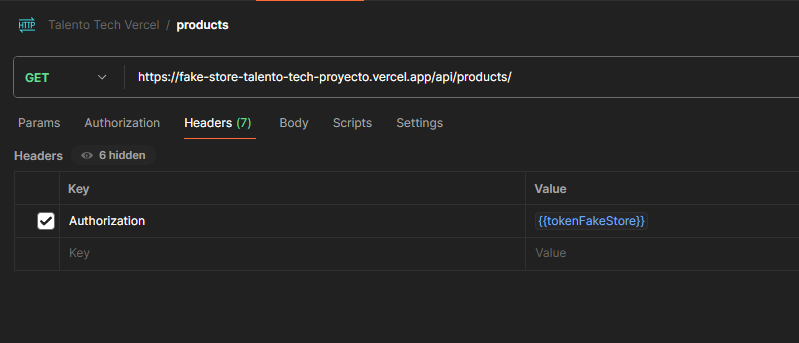

# API REST en Node.js

## JSON POSTMAN
- [JSON DE POSTMAN](https://github.com/Francary/FakeStore-Talento-Tech-Proyecto/blob/master/Postman.jsom)

## RUTAS

- Login para Obtener Token:   
    `POST /api/login`  
  **Cuerpo del body:**

  ```json
  
  {
    "email": "admin@admin.com",
    "password": "imposible",
  }

- Crear un nuevo usuario:  
    `POST /api/users`  
  **Cuerpo del body:**

  ```json
  
  {
    "email": "admin@admin.com",
    "password": "imposible",
    "isAdmin": true
  }

- Consultar todos los usuarios:  
    `GET /api/users`

- Consultar todos los productos:  
    `GET /api/products`

- Consultar un producto por ID:  
    `GET /api/products/:id`

- Crear un nuevo producto:  
    `POST /api/products`  
  **Cuerpo del body:**

  ```json
  {
    "name": "Procesador AMD 9700",
    "price": 700,
    "description": "Procesador Gamer",
    "Categoria": ["Gamer", "Computacion"]
  }

- Eliminar un producto por ID:   
    `DELETE /api/products/:id`

- Actualizar un producto:  
    `PUT /api/products/:id`

## Authorization

Para la autenticacion use los Headers para enviar mi TOKEN
> Key Authorization  
 Value {{tokenFakeStore}} --> Que una variable Global para no tener que estarlo cambiado en cada peticion



## Tecnologias
    
    
    
    
    
    


## API EN VERCEL
[Link API VERCEL](https://fake-store-talento-tech-proyecto.vercel.app/)

